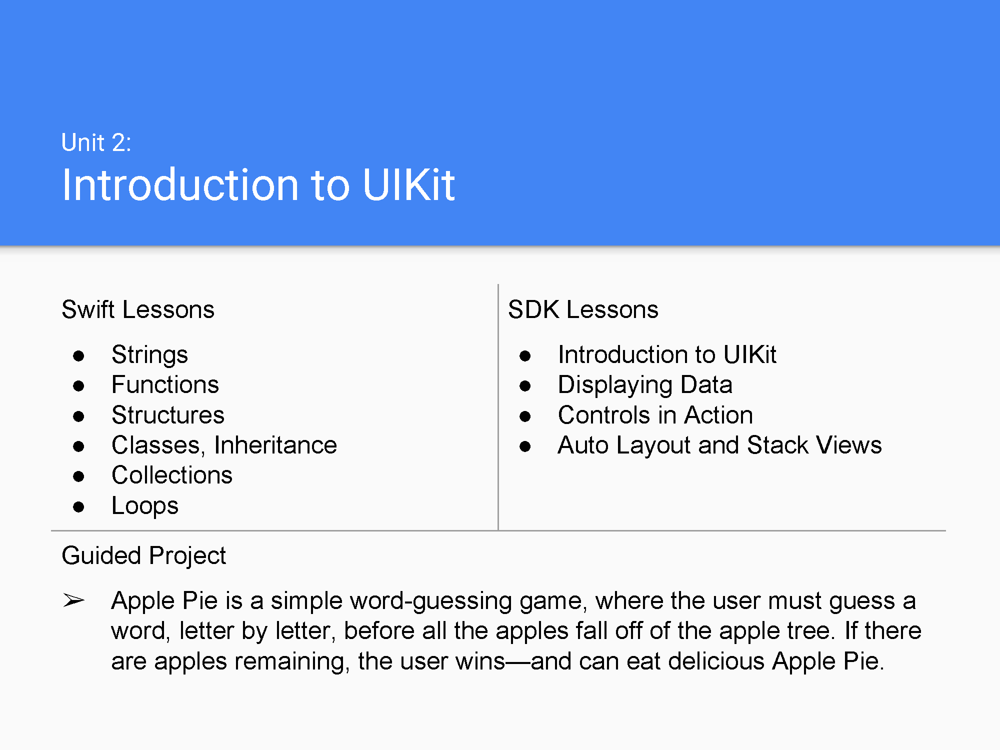

# Introduction to UIKit

Swift Lessons
● Strings
● Functions
● Structures
● Classes, Inheritance
● Collections
● Loops

SDK Lessons
● Introduction to UIKit
● Displaying Data
● Controls in Action
● Auto Layout and Stack Views

Guided Project
➢ Apple Pie is a simple word-guessing game, where the user must guess a word, letter by letter, before all the apples fall off of the apple tree. If there are apples remaining, the user wins—and can eat delicious Apple Pie.
